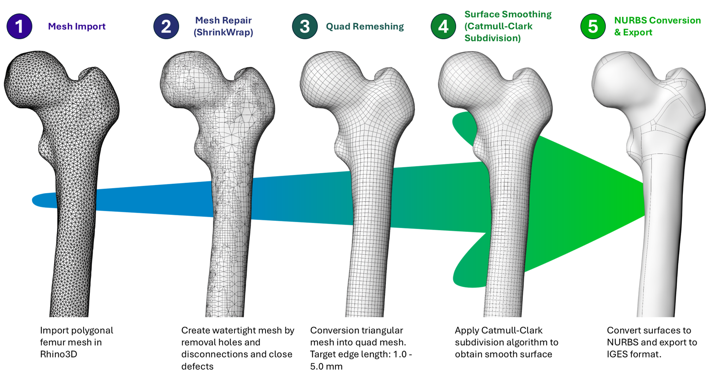

# Mesh2NURBS-Rhino3D
<p align="center">
    
</p>

<p align="center">
    <a href=""></a>
    <a href=""></a>
</p>


# Introduction

A python package for converting 3D meshes into NURBS models (e.g. IGES format) through Rhino3D software.

This work has been presented at **[CAOS 2026](https://caos2026.org/)**. Paper DOI will be published once available.

## Requirements

1.  Rhino 8 needs to be installed and able to be executed from `C:\Program Files\Rhino 8\System\Rhino.exe`
2.  [Miniconda](https://www.anaconda.com/docs/getting-started/miniconda/install/overview)

## Installation

Create a conda environment:

```bash
conda create -n mesh2nurbs-rhino3d python==3.10
```

Activate the environment:

```bash
conda activate mesh2nurbs-rhino3d
```

Install the package:

```bash
pip install git+https://github.com/BoneHub/Mesh2NURBS-Rhino3D.git
```


## Usage

### Command-line

**Note**: Activate the conda environment before running the command-line tool.

The package installs the `mesh2nurbs-rhino3d` command. It launches Rhino, processes one mesh file or all supported meshes in a folder, and exports the result as IGES or STEP.

#### Arguments

| Argument | Type | Default | Description |
| --- | --- | --- | --- |
| `-i, --input-path` | path | current working directory | Input mesh file or folder. If a folder is provided, all `.stl`, `.obj`, and `.ply` files in that folder are processed. |
| `--output-filetype` | `iges` or `step` | `iges` | Output CAD file type. |
| `--preprocessing-steps` | one or more of `none`, `shrinkwrap`, `fixholes`, `remove-isolated-islands` | `none` | Chain of preprocessing steps applied before conversion, in the given order. `none` skips preprocessing and cannot be combined with other steps. See [Preprocessing](#preprocessing). |
| `--smoothing` | float | `0.0` | Smoothing value used by the `shrinkwrap` step. Ignored if `shrinkwrap` is not in the chain. |
| `--nosubd` | flag | `False` | Skip the SubD step and convert directly to NURBS. Produces non-smooth patch connections. |
| `--packed-patches` | flag | `False` | Pack NURBS patches together during SubD-to-NURBS conversion. Only works when SubD is enabled. |
| `--force-ncps-u` | int | `0` | Force the number of control points in the U direction during rebuild. If `0`, Rhino decides automatically. |
| `--force-ncps-v` | int | `0` | Force the number of control points in the V direction during rebuild. If `0`, Rhino decides automatically. |
| `--quadremesh-length` | float | `2.0` | Target QuadRemesh edge length in millimeters. |
| `--shrinkwrap-length` | float | `1.0` | Target shrinkwrap edge length in millimeters. Used only when `shrinkwrap` is in the preprocessing chain. |
| `--rhino-path` | path | `C:\Program Files\Rhino 8\System\Rhino.exe` | Path to the Rhino executable. |
| `--keep-open` | flag | `False` | Leave Rhino open after processing finishes. |
| `--no-display` | flag | `False` | Avoids displaying objects in Rhino to reduce processing time. |

#### Preprocessing

`--preprocessing-steps` accepts one or more steps separated by spaces. All steps run inside Rhino3D in the given order, and each step works on the result of the previous one. The same step can be listed more than once.

| Step | What it does in Rhino3D |
| --- | --- |
| `shrinkwrap` | Replaces the mesh with a watertight shrink-wrapped mesh (`ShrinkWrap`). Uses `--shrinkwrap-length` and `--smoothing`. |
| `fixholes` | Fills all holes in the mesh (`FillMeshHoles`). |
| `remove-isolated-islands` | Keeps only the largest connected mesh and deletes everything else. All meshes in the file are combined, split into connected parts, and the part with the largest surface area is kept. Useful for removing loose fragments and inner shells. |

Example: remove loose fragments, fill the holes, then shrink-wrap the result:

```bash
mesh2nurbs-rhino3d -i "C:\path\to\mesh.stl" --preprocessing-steps remove-isolated-islands fixholes shrinkwrap
```

#### Examples

Process a single mesh with the default pipeline:

```bash
mesh2nurbs-rhino3d -i "C:\path\to\mesh.obj"
```

Use preprocessing with shrinkwrap, custom remeshing, and packed patches:

```bash
mesh2nurbs-rhino3d -i "C:\path\to\mesh.obj" \
    --preprocessing-steps shrinkwrap \
    --shrinkwrap-length 1.5 \
    --quadremesh-length 2.5 \
    --packed-patches
```

Skip SubD and convert directly to NURBS:

```bash
mesh2nurbs-rhino3d -i "C:\path\to\mesh.obj" --nosubd
```

Force the NURBS rebuild to use specific control point counts in both directions:

```bash
mesh2nurbs-rhino3d -i "C:\path\to\mesh.obj" --force-ncps-u 8 --force-ncps-v 8
```

Process every supported mesh in a folder and keep Rhino open:

```bash
mesh2nurbs-rhino3d -i "C:\path\to\folder" --output-filetype step --keep-open
```

Recommended argument combinations:

| Argument | Example | Notes |
| --- | --- | --- |
| `--preprocessing-steps` | `--preprocessing-steps remove-isolated-islands shrinkwrap` | Steps run in the given order. When `shrinkwrap` is included, you can also set `--smoothing` and `--shrinkwrap-length`. |
| `--nosubd` | `--nosubd` | Disables SubD; do not use with `--packed-patches` if you want packed output. |
| `--packed-patches` | `--packed-patches` | Use only when SubD is enabled. |
| `--force-ncps-u` | `--force-ncps-u 8` | Must be combined with `--force-ncps-v` and both values must be greater than 3. |
| `--force-ncps-v` | `--force-ncps-v 8` | Must be combined with `--force-ncps-u` and both values must be greater than 3. |
| `--quadremesh-length` | `--quadremesh-length 1.5` | Smaller values create a finer quad remesh. |

